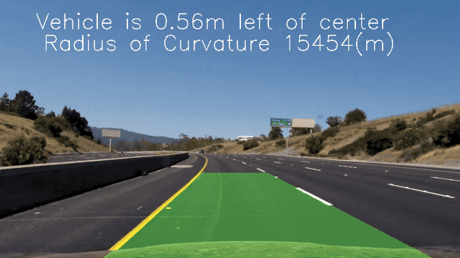

## Advanced Lane Finding
[](http://www.udacity.com/drive)



[YouTube Link](https://youtu.be/bImDVfLr7Eg)

---

**Advanced Lane Finding Project**

The goals / steps of this project are the following:

* Compute the camera calibration matrix and distortion coefficients given a set of chessboard images.
* Apply a distortion correction to raw images.
* Use color transforms, gradients, etc., to create a thresholded binary image.
* Apply a perspective transform to rectify binary image ("birds-eye view").
* Detect lane pixels and fit to find the lane boundary.
* Determine the curvature of the lane and vehicle position with respect to center.
* Warp the detected lane boundaries back onto the original image.
* Output visual display of the lane boundaries and numerical estimation of lane curvature and vehicle position.

[//]: # (Image References)

[image1]: ./examples/undistort_output.png "Undistorted"
[image2]: ./examples/orig_undistorted.png "Undistorted"
[image3]: ./examples/binary_combo_example.png "Binary Example"
[image4]: ./examples/warped_straight_lines.png "Warp Example"
[image5]: ./examples/color_fit_lines.jpg "Fit Visual"
[image6]: ./examples/example_output.png "Output"
[video1]: ./examples/project_video.mp4 "Video"

---

### Camera Calibration

#### 1. Briefly state how you computed the camera matrix and distortion coefficients. Provide an example of a distortion corrected calibration image.

The code for this step is contained in the Preprocess class of the IPython notebook located in "./advanced-lane-finding.ipynb"

I start by preparing "object points", which will be the (x, y, z) coordinates of the chessboard corners in the world. Here I am assuming the chessboard is fixed on the (x, y) plane at z=0, such that the object points are the same for each calibration image.  Thus, `objp` is just a replicated array of coordinates, and `objpoints` will be appended with a copy of it every time I successfully detect all chessboard corners in a test image.  `imgpoints` will be appended with the (x, y) pixel position of each of the corners in the image plane with each successful chessboard detection.  

I then used the output `objpoints` and `imgpoints` to compute the camera calibration and distortion coefficients using the `cv2.calibrateCamera()` function.  I applied this distortion correction to the test image using the `cv2.undistort()` function and obtained this result: 

![alt text][image1] 


### Pipeline (single images)

#### 1. Provide an example of a distortion-corrected image.

I used the undistort() to calculate camera calibration matrix and distortion coefficients. It can remove distortion of image and output the undistorted image.
![alt text][image2]

#### 2. Describe how (and identify where in your code) you used color transforms, gradients or other methods to create a thresholded binary image.  Provide an example of a binary image result.

In this step i choose L channel of LUV and b channel of Lab. Because L channel represents luminance which is suit for the white lane line, and b channel is suit for the yellow lane line. Finally combine them together is prefect for the lane line.

![alt text][image3]

#### 3. Describe how (and identify where in your code) you performed a perspective transform and provide an example of a transformed image.

In this step I will use birds_eye() to transform the undistorted image to "birdseye" of the lane, and displays 
them in such a way that they appear to be relatively parallel to eachother. It can be convenient for fit polynomials
to the lane line and measure the curvature.

The code for my perspective transform includes a function called `birds_eye()`.  I chose the hardcode the source and destination points in the following manner:

```python
perspective_src = np.float32([[490, 482],[810, 482], 
                                [1250, 720],[40, 720]])
perspective_dst = np.float32([[0, 0], [1280, 0], 
                                [1250, 720],[40, 720]])
```

I verified that my perspective transform was working as expected by drawing the `src` and `dst` points onto a test image and its warped counterpart to verify that the lines appear parallel in the warped image.

![alt text][image4]

#### 4. Describe how (and identify where in your code) you identified lane-line pixels and fit their positions with a polynomial?

Then I did some other stuff and fit my lane lines with a 2nd order polynomial kinda like this:

![alt text][image5]

#### 5. Describe how (and identify where in your code) you calculated the radius of curvature of the lane and the position of the vehicle with respect to center.

I did this in lines through in my code in `fill_lane()`

#### 6. Provide an example image of your result plotted back down onto the road such that the lane area is identified clearly.

I also did this in lines through in my code in `fill_lane()`.  Here is an example of my result on a test image:

![alt text][image6]

---
